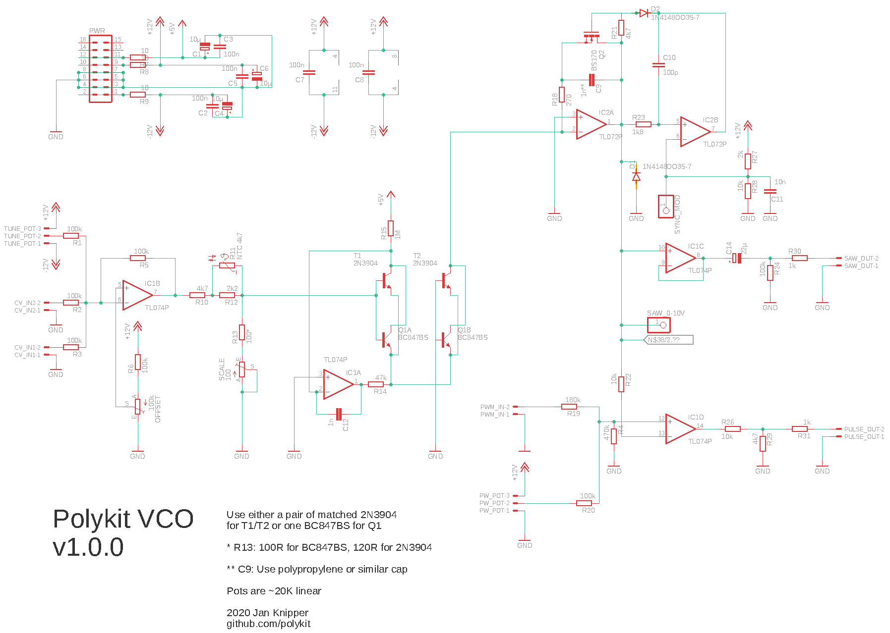

# Polykit VCO-1

This repository contains schematics and PCB layout for a voltage controlled oscillator (VCO). The goal was to keep price and component count low while having a good 1V/oct tracking. The oscillator core is roughly bases on the Jupiter 8 with a simpler approach for the current sink. It either needs a pair of matched 2N3904 transistors or one BC847BS dual transistor. I have very good results with the BC847BS and an accurate tracking over several octaves. On the output it generates a ramp and a pulse signal with 10Vpp amplitude. There is also a CV input for pulse width modulation.

Note: PCB also contains a simple sub-oscillator with output for one and two octaves down

There is also a PCB version with [eight oscillators on it](https://github.com/polykit/vco-8).

# References

https://www.muffwiggler.com/forum/viewtopic.php?t=92595

https://kassu2000.blogspot.com/2015/12/vco-part-1-core.html

https://kassu2000.blogspot.com/2015/10/transistor-matching.html

http://www.synthdiy.com/files/2008/RolandJupiter8-ServiceNotes.pdf
